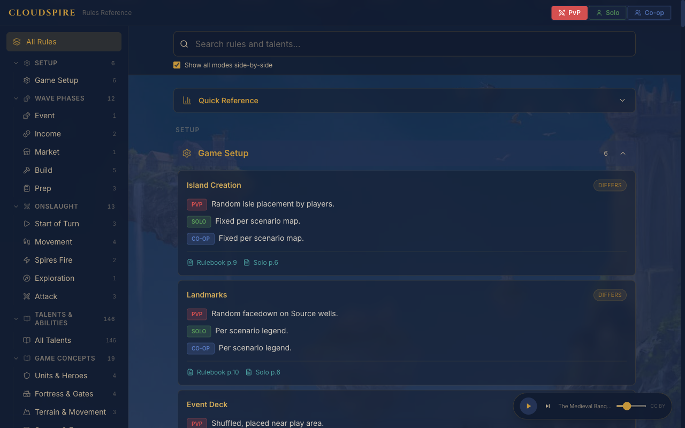

# Cloudspire Rules Reference

[](https://github.com/olohmann/cloudspire/actions/workflows/ci.yml)
[](https://github.com/olohmann/cloudspire/actions/workflows/release.yml)

[](https://opensource.org/licenses/MIT)

An interactive quick-reference web application for the [Cloudspire](https://chiptheorygames.com/pages/support/cloudspire) board game by [Chip Theory Games](https://chiptheorygames.com). Designed to help players quickly look up rules, talents, and abilities during gameplay.



## Features

- **Mode-aware rules** — view rules for PvP, Solo, and Co-op side by side, or filter by mode
- **Full-text search** — instantly search across all rules, talents, and abilities
- **PDF viewer** — open rulebook pages directly from rule references
- **146 talents & abilities** — complete talent list with AI variant descriptions
- **Ambient music player** — optional background music (CC BY 4.0)
- **Mobile-friendly** — responsive layout for use at the game table

## Getting Started

### Prerequisites

- [Node.js](https://nodejs.org/) 22+
- npm

### Development

```bash
npm install
npm run dev
```

Open [http://localhost:5173](http://localhost:5173) in your browser.

### Build

```bash
npm run build
npm run preview
```

## Deployment

### Docker

```bash
docker pull ghcr.io/olohmann/cloudspire:latest

docker run -p 8080:8080 ghcr.io/olohmann/cloudspire:latest
```

### Helm

```bash
helm pull oci://ghcr.io/olohmann/charts/cloudspire --version 0.1.0

helm install cloudspire oci://ghcr.io/olohmann/charts/cloudspire --version 0.1.0
```

## Tech Stack

- [React](https://react.dev/) 19 + [TypeScript](https://www.typescriptlang.org/)
- [Vite](https://vite.dev/) 8
- [Tailwind CSS](https://tailwindcss.com/) 4
- [react-pdf](https://github.com/wojtekmaj/react-pdf) for in-app PDF viewing
- [Nginx](https://nginx.org/) (Alpine) for production serving

## Attribution & Legal Notice

**Cloudspire** is a board game designed and published by [Chip Theory Games](https://chiptheorygames.com), Plymouth, MN.

All game content, rules, terminology, faction names, artwork, and PDF documents referenced or included in this application are the intellectual property of Chip Theory Games. This project is an unofficial fan-made tool and is not affiliated with, endorsed by, or sponsored by Chip Theory Games.

This application is intended solely as a personal reference aid for owners of the Cloudspire board game. It does not replace the official game materials. If you do not own the game, please support the creators by purchasing it from the [official store](https://chiptheorygames.com).

**Music:** Background tracks by [Shane Ivers](https://www.silvermansound.com) (Silverman Sound), licensed under [CC BY 4.0](https://creativecommons.org/licenses/by/4.0/).

## License

This project's source code is licensed under the [MIT License](LICENSE). Note that game content (rules, terminology, artwork, PDFs) remains the property of Chip Theory Games.
